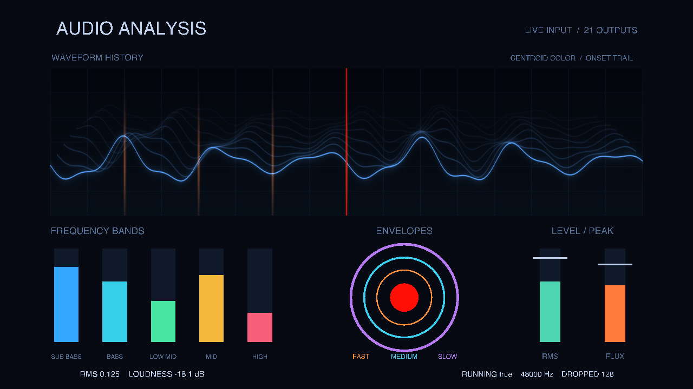

# Live audio examples

Both scenes require the `com.jvclabs.FabricAudioAnalysis` plug-in. Restart Fabric
Editor after installing an updated bundle. Run a scene and allow Fabric
microphone access when macOS asks.

## Box scaling

`LiveAudioAnalysis.fabric` contains eight nodes. Live Audio Analysis's Medium
Envelope is increased by 0.35 and sent to the box's X, Y, and Z scale. The box
stays visible during silence and grows as the envelope rises. Each Onset
flashes the box red for at least 0.2 seconds, then it returns to white.

Onset drives a Trigger node named Onset Flash, whose output selects the
white or red color through an Easing node named Onset Color. Change the
Trigger's Minimum Duration to adjust the flash length.

## Advanced scene

Open `LiveAudioAnalysisAdvanced.fabric` for a coordinated dashboard driven by
all 21 outputs from one Live Audio Analysis node. Use a 16:9 render viewport
for the intended framing. Six named subgraphs expose the corresponding source
values at their boundaries; enter a group to inspect or edit its mappings.

The preview above is rendered from synthetic values by the verification tool.
The saved scene opens with live microphone capture enabled.

| Source output | Visible role |
| --- | --- |
| RMS | Raw amplitude readout |
| RMS Normalized | Central sphere scale and RMS meter height |
| Loudness dB | Decibel readout |
| Loudness Normalized | Background brightness |
| Onset | Red center flash, red waveform playhead, and scrolling hit markers |
| Sub Bass | First frequency meter |
| Bass | Second frequency meter |
| Low Mid | Third frequency meter |
| Mid | Fourth frequency meter |
| High | Fifth frequency meter |
| Spectral Flux | Flux meter height and new hit-marker intensity |
| Spectral Centroid | Waveform color, shifting from cyan toward violet as it rises |
| Peak RMS | White marker on the RMS meter |
| Peak Flux | White marker on the flux meter |
| Fast Envelope | Inner orange ring radius |
| Medium Envelope | Middle cyan ring radius |
| Slow Envelope | Outer violet ring radius |
| Waveform History | Layered waveform with older rows receding behind the newest |
| Running | Capture status readout |
| Sample Rate | Sample-rate readout and centroid color normalization |
| Dropped Samples | Capture-loss readout |

Waveform Trail is the only new visual node. It consumes the supplied waveform,
onset, intensity, and color. The other elements use existing Math Expression,
String Formatter, geometry, material, mesh, Trigger, and Easing nodes. The three
envelope colors correspond to the labels below the rings. The white peak markers
show peak-held normalized values, rather than raw sample amplitudes.

The onset markers scroll from the center to the left over four seconds. Enter
Waveform & Onsets to adjust Waveform Trail's duration, amplitude, thickness,
glow, or resolution. The center sphere uses a separate Trigger to hold each red
flash for at least 0.2 seconds.

## Verification and regeneration

Check registration and reopen the saved graph with
`sh PluginVerification/verify.sh` from the repository root.

The check reopens both graphs and exercises them with synthetic values without
requesting microphone access. It also renders the advanced scene on the GPU.

Regenerate the basic example with `sh PluginVerification/verify.sh --write-samples`.
Regenerate only the advanced example and its preview with
`sh PluginVerification/verify.sh --write-advanced`.
Export a preview from the existing advanced graph without rewriting it with
`sh PluginVerification/verify.sh --preview-advanced`.
