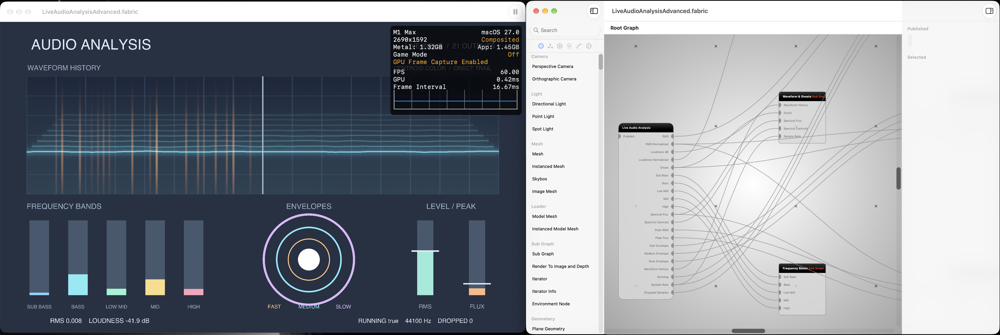

# Fabric Audio Analysis

A [Fabric](https://github.com/Fabric-Project/Fabric) plug-in for live microphone
analysis. It registers **Live Audio Analysis**
with stable, typed ports for driving audio-reactive graphs, and **Waveform Trail**
for drawing supplied waveform history and onset pulses. The behavior and
acceptance checks are in [PLUG_IN_PLAN.md](PLUG_IN_PLAN.md).

## Fabric version

Developed and verified against **Fabric 0.1 (build 15)** from a development source
checkout at commit
[940f3e06881f0bcd4812fc8fecbaa1a98c47bf7e](https://github.com/Fabric-Project/Fabric/commit/940f3e06881f0bcd4812fc8fecbaa1a98c47bf7e)
(September 29, 2026). The version and build number come from that checkout's
Xcode project; the commit identifies the exact Fabric source used for plugin
builds, discovery, scene save/reopen, and advanced-scene GPU verification.

## Current state

`AudioAnalysisCore` is a Swift 5.9, macOS 15+ package with no Fabric
dependency. It defines immutable analysis values, a 2048-point FFT frame
analyzer, a streaming onset detector, and microphone capture. The analyzer
emits raw RMS, loudness, five frequency-band energies, spectral flux, spectral
centroid, peak levels, and envelopes.

The node captures the system default microphone and analyzes samples outside
Fabric's render call. Its fixed-size sample ring drops old samples if analysis
falls behind instead of building an unbounded queue. Each graph pass publishes
the newest completed snapshot and preserves any onset since the previous pass.
It also publishes 24 oldest-to-newest waveform rows of 192 signed samples each.
Rows use one byte per sample internally, and capture retains only the newest
24 rows. The node expands those rows into floats only when Waveform History
is connected or published. Reused analysis frames and onset clearing reuse
the existing waveform output.

`Dropped Samples` reports the cumulative number of mono input samples lost
to ring overflow or lock contention. Counting never waits for a lock in the
audio callback. The count resets when capture restarts, the graph stops, or
the node is disabled.

`Enabled` defaults to true. Capture starts while the graph runs, after macOS
grants Fabric microphone access, and stops when the graph stops or the node is
disabled. `Running` and `Sample Rate` report capture status. Settings offer
analysis FPS (default 30, range 1 to 120). The node uses the system default
microphone without device selection.

The host application must declare `NSMicrophoneUsageDescription`; Fabric Editor
does so already.

Invalid capacities and unavailable FFT buffers throw descriptive core errors.
Live Audio Analysis reports capture and analysis failures as recoverable Fabric
errors, allowing the rest of the scene to render. The default onset trail uses
a fixed capacity of 512; creating one with a custom capacity requires `try`.

The [box-scaling example](FabricScenes/README.md) uses Live Audio Analysis's
Medium Envelope plus 0.35 to scale a rendered box uniformly. The box stays
visible during silence and grows as the envelope rises. Onset flashes the
box red for at least 0.2 seconds before returning to white.

The [advanced example](FabricScenes/README.md#advanced-scene) uses all 21 outputs
from one microphone source. Six named subgraphs organize a waveform and onset
trail, five frequency meters, three envelope rings, RMS and flux peak meters,
background brightness, and capture readouts. Most visuals use Fabric's existing
nodes; Waveform Trail handles the layered waveform and scrolling hit markers.



## Node port reference

All normalized values are in `0...1`. RMS, frequency bands, and spectral flux
use a rolling 180-frame maximum. Loudness Normalized uses a fixed
`-60...0 dB` mapping.

| Port | Direction | Fabric type | Default or requirement | Description |
| --- | --- | --- | --- | --- |
| RMS | Output | Float | 0 before data | Raw root-mean-square amplitude |
| RMS Normalized | Output | Float | 0 before data | RMS divided by the source's normalization-window maximum |
| Loudness dB | Output | Float | -140 before data | `20 log10(RMS)` in decibels |
| Loudness Normalized | Output | Float | 0 before data | Fixed mapping of `-60...0 dB` to `0...1` |
| Onset | Output | Bool | false before data | Pulses once for captured onsets since the previous graph pass |
| Sub Bass | Output | Float | 0 before data | Normalized energy at 20 to 60 Hz |
| Bass | Output | Float | 0 before data | Normalized energy at 60 to 250 Hz |
| Low Mid | Output | Float | 0 before data | Normalized energy at 250 to 500 Hz |
| Mid | Output | Float | 0 before data | Normalized energy at 500 to 2000 Hz |
| High | Output | Float | 0 before data | Normalized energy at 2000 Hz to Nyquist or 20000 Hz |
| Spectral Flux | Output | Float | 0 before data | Normalized positive spectral change |
| Spectral Centroid | Output | Float | 0 before data | Spectral center of mass in Hz |
| Peak RMS | Output | Float | 0 before data | Peak-held normalized RMS |
| Peak Flux | Output | Float | 0 before data | Peak-held normalized flux |
| Fast Envelope | Output | Float | 0 before data | Normalized RMS envelope with fast release |
| Medium Envelope | Output | Float | 0 before data | Normalized RMS envelope with medium release |
| Slow Envelope | Output | Float | 0 before data | Normalized RMS envelope with slow release |
| Waveform History | Output | Array of Float | 24 × 192 zero samples before data when connected or published | Signed, oldest-to-newest waveform rows for downstream nodes |

### Live Audio Analysis

| Port | Direction | Fabric type | Default or requirement | Description |
| --- | --- | --- | --- | --- |
| Enabled | Input | Bool | true | Allows capture while the graph runs |
| Running | Output | Bool | false | True after the microphone engine starts |
| Sample Rate | Output | Float | 0 before capture | Input sample rate in Hz |
| Dropped Samples | Output | Index (Int) | 0 before capture | Cumulative mono samples lost to ring overflow or lock contention in the current capture generation |

### Waveform Trail

This image generator uses supplied analysis; it does not capture or analyze
audio. It draws up to eight layers from the newest 24 waveform rows, with older
layers receding behind the current waveform. Each onset flashes the center
playhead red for 0.2 seconds and adds a marker that travels toward the left edge
over Trail Duration. Marker motion follows scene time, including graph passes
between analysis frames. Restarting or rewinding the scene clears the markers.

| Port | Direction | Fabric type | Default | Description |
| --- | --- | --- | --- | --- |
| Waveform History | Input | Array of Float | Empty | Signed samples grouped into oldest-to-newest rows of 192; a single row also works |
| Onset | Input | Bool | false | A hit pulse for the current graph pass |
| Intensity | Input | Float | 1 | Strength of each new onset marker, normally driven by Spectral Flux |
| Color | Input | Color | Cyan | Waveform tint |
| Amplitude | Input | Float | 0.25 | Waveform height relative to the image |
| Thickness | Input | Float | 0.004 | Line width relative to the image height |
| Glow | Input | Float | 1.4 | Glow strength |
| Trail Duration | Input | Float | 4 | Seconds for an onset to travel from center to left edge |
| Width | Input | Index (Int) | 1280 | Output width, clamped to 64...4096 pixels |
| Height | Input | Index (Int) | 320 | Output height, clamped to 32...2048 pixels |
| Image | Output | Image | — | An opaque RGBA image with a dark grid background |

Onset history is bounded to 512 markers. Three reusable upload buffers keep
CPU writes separate from submitted GPU work. If all buffers are still in use,
the node keeps its previous image instead of waiting for the GPU.

Run the focused core checks with:

```sh
swift test --package-path AudioAnalysisCore
```

Build and install the development bundle from this repository root:

```sh
xcodebuild \
  -project FabricAudioAnalysis/FabricAudioAnalysis.xcodeproj \
  -scheme FabricAudioAnalysis \
  -configuration Debug \
  -destination 'platform=macOS' \
  build
```

The target builds the adjacent `../Fabric` checkout in an isolated
`.fabric-spm` directory and installs an ad-hoc signed copy in
`~/Library/Application Support/Fabric/Plugins/`. To use a different checkout,
pass `FABRIC_SOURCE_ROOT=/absolute/path/to/Fabric` to `xcodebuild`. See
[Fabric version](#fabric-version) for the development target used for verification.

When replacing an earlier development bundle, move it out of Fabric's
`Plugins` directory before running the new plug-in. Both bundles register the
same Live Audio Analysis node name, so installing both causes a registration
conflict. This plug-in uses the identifier `com.jvclabs.FabricAudioAnalysis`.

After building, check registration, graph save/reopen, waveform demand,
uniform box scaling, onset color flashes, and the advanced scene through Fabric's
own `NodeRegistry`:

```sh
sh PluginVerification/verify.sh
```

`PluginVerification/Package.resolved` matches the selected Fabric checkout's
package lock. Refresh it from that checkout when updating the host revision.
The verification script prepares a local Sparkle copy needed by Fabric's
command-line host executable; it does not change the Fabric checkout. It also
accepts `FABRIC_SPM_SCRATCH_PATH` to reuse an existing compatible Fabric build.
The box check disables microphone capture and supplies envelope and onset
values, so it can verify scaling and the red flash without requesting
microphone access.

The advanced check also disables capture, supplies synthetic values to all 21
outputs, and renders the saved scene through Metal. It checks the nested graph
connections, meter and peak positions, capture text, and onset flash release.
Use `--preview-advanced` to export that synthetic render, or `--write-advanced`
to regenerate only the advanced scene and its preview. The basic example is
not rewritten by either option.

Pass `--measure-box` to the verification script for a synthetic CPU timing
sample of the saved graph. It warms up for 200 passes, then reports median
and p95 time over 1000 passes with changing envelope and onset values. This
measurement excludes microphone capture, FFT, drawing, and GPU completion.

Restart Fabric Editor after updating the installed bundle; its registry loads
external plug-ins at startup.

The analyzer and onset threshold are adapted from
[AudioSourceProcessorExample](https://github.com/jvcleave/AudioSourceProcessorExample)
commit `4db4e252f88339e7f7833fa37a42230779b4a904`. A separate analyzer instance
is required for each ordered microphone stream because spectral flux depends
on its preceding frame.
